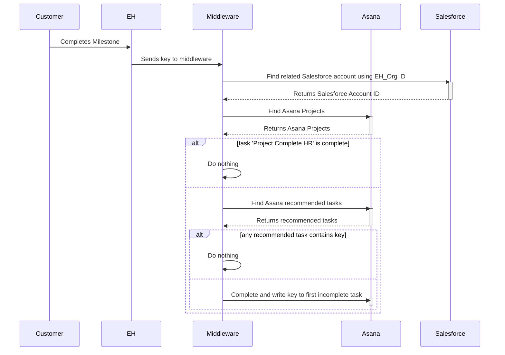

# test-repo

```mermaid
 sequenceDiagram
  participant Customer
  participant EH
  participant Middleware
  participant Asana
  participant Salesforce
  Customer->>EH: Completes Milestone
  EH->>Middleware: Sends key to middleware
  Middleware->>Salesforce: Find related Salesforce account using EH_Org ID
  activate Salesforce
  Salesforce-->>Middleware: Returns Salesforce Account ID
  deactivate Salesforce
  Middleware->>Asana: Find Asana Projects
  activate Asana
  Asana-->>Middleware: Returns Asana Projects
  deactivate Asana
  alt task 'Project Complete HR' is complete
    Middleware->>Middleware: Do nothing
  else 
    Middleware->>Asana: Find Asana recommended tasks
    activate Asana
    Asana-->>Middleware: Returns recommended tasks
    deactivate Asana
    alt any recommended task contains key
      Middleware->>Middleware: Do nothing
    else
      Middleware->>Asana: Complete and write key to first incomplete  task
      activate Asana
      deactivate Asana
    end
  end
```
